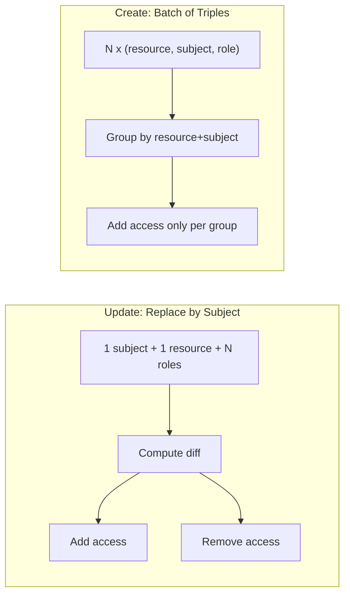
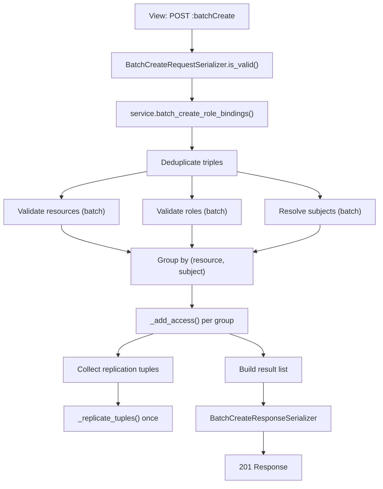

# Create RoleBinding API — Scenarios and Reuse Analysis

## API Shape (from typespec)

The create API is **not** by-subject. It is a **batch** endpoint at `POST /role-bindings/:batchCreate`.

**Request** (`BatchCreateRoleBindingsRequest`):

```json
{
  "requests": [
    {
      "resource": { "id": "<uuid>", "type": "workspace" },
      "subject": { "id": "<uuid>", "type": "group" },
      "role": { "id": "<uuid>" }
    },
    {
      "resource": { "id": "<uuid>", "type": "workspace" },
      "subject": { "id": "<uuid>", "type": "user" },
      "role": { "id": "<uuid>" }
    }
  ]
}
```

**Response** (201 `BatchCreateRoleBindingsResponse`):

```json
{
  "role_bindings": [
    {
      "role": { "id": "<uuid>" },
      "subject": { "id": "<uuid>", "type": "group" },
      "resource": { "id": "<uuid>", "type": "workspace" }
    }
  ]
}
```

Key constraints from typespec: `requests` has `@minItems(1)` and `@maxItems(100)`.

## Structural Differences: Create vs Update

| Aspect | Update (PUT by-subject/) | Create (POST :batchCreate) |

|--------|-------------------------|---------------------------|

| Cardinality | 1 subject, 1 resource, N roles | N triples of (1 resource, 1 subject, 1 role) |

| Semantics | Replace (declarative) | Additive (only adds) |

| Response shape | `{subject, roles, resource}` (per-subject) | `{role_bindings: [{role, subject, resource}, ...]}` (per-binding) |

| Status code | 200 | 201 |

| Route | `by-subject/` | `:batchCreate` |



## Service Processing Strategy

The service receives a list of `(resource, subject, role)` triples. To reuse `_add_access`, we group the triples by `(resource_type, resource_id, subject_type, subject_id)` and process each group:

1. Validate all unique resources exist (batch `_validate_resource`)
2. Validate all unique roles exist and are assignable (batch `_get_roles`)
3. Resolve all unique subjects (batch `Subject.objects.by_type`)
4. For each `(resource, subject)` group, call `_add_access` with the grouped role IDs
5. Collect replication tuples from all groups
6. Replicate once

## Test Scenarios for the Service

### Happy Path -- Single Item Requests

| # | Scenario | Given | When | Then (DB) | Then (Replication) |

|---|----------|-------|------|-----------|-------------------|

| 1 | **Single triple: group + role on resource** | No prior bindings | Create `[{ws, group1, role1}]` | Binding created, group linked | binding tuples + group subject tuple |

| 2 | **Single triple: user + role on resource** | No prior bindings | Create `[{ws, user1, role1}]` | Binding created, user linked | binding tuples + user subject tuple |

| 3 | **Idempotent -- binding already exists for same subject** | group1 already has role1 on ws | Create `[{ws, group1, role1}]` | No new rows | No tuples replicated |

| 4 | **Reuse existing binding from another subject** | user2 has role1 on ws | Create `[{ws, user1, role1}]` | user1 linked to existing binding (no new RoleBinding row) | Only user1 subject tuple added |

### Happy Path -- Batch Requests

| # | Scenario | Given | When | Then (DB) | Then (Replication) |

|---|----------|-------|------|-----------|-------------------|

| 5 | **Same resource+role, different subjects** | No prior bindings | Create `[{ws, group1, role1}, {ws, user1, role1}]` | 1 binding, group1+user1 linked | binding tuples + 2 subject tuples |

| 6 | **Same resource+subject, different roles** | No prior bindings | Create `[{ws, group1, role1}, {ws, group1, role2}]` | 2 bindings, group1 linked to both | 2x binding tuples + 2 subject tuples |

| 7 | **Different resources** | No prior bindings | Create `[{ws1, group1, role1}, {ws2, group1, role1}]` | 2 separate bindings on ws1 and ws2 | Tuples for both resources |

| 8 | **Mixed group and user subjects** | No prior bindings | Create `[{ws, group1, role1}, {ws, user1, role2}]` | 2 bindings with different subject types | group uses `#member` relation, user uses direct |

| 9 | **Batch with partial overlap** | group1 has role1 on ws | Create `[{ws, group1, role1}, {ws, group1, role2}]` | role1 no-op, role2 added | Only role2 tuples |

| 10 | **Existing bindings not removed** | group1 has role1 on ws | Create `[{ws, group1, role2}]` | role1 untouched, role2 added | Only role2 tuples |

| 11 | **Cross-resource isolation** | user1 has role1 on ws1 | Create `[{ws2, user1, role1}]` | ws1 untouched, new binding on ws2 | Only ws2 tuples |

| 12 | **Duplicate triples within batch** | No prior bindings | Create `[{ws, group1, role1}, {ws, group1, role1}]` | 1 binding created, group1 linked once | binding tuples + 1 subject tuple (deduplicated) |

### Validation / Error Scenarios

| # | Scenario | Expected Error |

|---|----------|---------------|

| 13 | Non-existent workspace in a request | `NotFoundError` (resource_type, resource_id) |

| 14 | Non-existent group subject | `NotFoundError` (group, id) |

| 15 | Non-existent user subject | `NotFoundError` (user, id) |

| 16 | Non-existent role UUID | `InvalidFieldError` (roles, missing UUIDs) |

| 17 | Unsupported subject_type | `UnsupportedSubjectTypeError` |

| 18 | Empty requests list | Serializer validation error (minItems=1) |

| 19 | Over 100 requests | Serializer validation error (maxItems=100) |

| 20 | Missing required fields in a request item (no resource.id, etc.) | Serializer validation error |

| 21 | All-or-nothing: one bad item fails the whole batch | Transaction rolls back, 0 bindings created |

## What Can Be Reused from the Update Branch

### Fully Reusable (no changes needed)

| Component | File | Notes |

|-----------|------|-------|

| `_validate_resource()` | [service.py](rbac/management/role_binding/service.py) | Same resource existence check; call once per unique resource |

| `_get_roles()` | [service.py](rbac/management/role_binding/service.py) | Collects all unique role IDs from the batch, validates in one query. Minor adaptation: currently requires non-empty list (will need to accept single role IDs collected into a list). |

| `Subject.objects.by_type()` | [queryset.py](rbac/management/subject/queryset.py) | Same subject resolution; call once per unique subject |

| `_add_access()` | [service.py](rbac/management/role_binding/service.py) | **Core workhorse.** Finds/creates bindings and links subjects. Call once per (resource, subject) group. |

| `_replicate_tuples()` | [service.py](rbac/management/role_binding/service.py) | Same outbox write |

| `RoleBinding.replication_tuples()` | [model.py](rbac/management/role_binding/model.py) | Same pure tuple computation (only `bindings_created` + `subject_linked_to`, never deleted/unlinked) |

| `RoleBindingFieldMaskingMixin` | [serializer.py](rbac/management/role_binding/serializer.py) | Response field masking helpers |

| `RoleBindingInputSerializerMixin` | [serializer.py](rbac/management/role_binding/serializer.py) | NUL-byte sanitization |

| `@atomic` decorator | [atomic_transactions.py](rbac/management/atomic_transactions.py) | Same serializable transaction wrapping |

### Not Needed for Create

| Component | Why |

|-----------|-----|

| `_remove_access()` | Create never removes |

| Orphan cleanup logic | No subjects are unlinked, so no orphans |

| `access_to_remove` diff computation | Only `access_to_add` matters |

| `UpdateRoleBindingResult` dataclass | Response is per-binding `{role, subject, resource}`, not per-subject `{subject, roles, resource}` |

| `UpdateRoleBindingResponseSerializer` | Different response shape |

### New Code Needed

1. **`batch_create_role_bindings()`** in [service.py](rbac/management/role_binding/service.py):

   - Accepts list of `(resource_type, resource_id, subject_type, subject_id, role_id)` triples
   - Deduplicates, validates resources/subjects/roles in bulk
   - Groups by `(resource, subject)`, calls `_add_access` per group
   - Collects replication tuples, replicates once
   - Returns list of created/resolved binding results

2. **Result dataclass** in [service.py](rbac/management/role_binding/service.py):

   - `CreateRoleBindingResult` with fields: `role`, `subject_type`, `subject`, `resource_id`, `resource_type`

3. **`BatchCreateRoleBindingsRequestSerializer`** in [serializer.py](rbac/management/role_binding/serializer.py):

   - Validates the nested `requests` array with min/max items
   - Each item validates `resource.{id, type}`, `subject.{id, type}`, `role.{id}`

4. **`BatchCreateRoleBindingsResponseSerializer`** in [serializer.py](rbac/management/role_binding/serializer.py):

   - Serializes each binding as `{role, subject, resource}` with field masking

5. **View action** in [view.py](rbac/management/role_binding/view.py):

   - `@action(detail=False, methods=["post"], url_path=":batchCreate") `on `RoleBindingViewSet`
   - Returns 201

6. **Service tests** in [test_service.py](tests/management/role_binding/test_service.py) -- scenarios 1-21 above.

7. **View tests** in [test_view.py](tests/management/role_binding/test_view.py) -- API-level tests.

### Architecture



The boxes `_validate_resource`, `_get_roles` (adapted), `Subject.objects.by_type`, `_add_access`, `replication_tuples`, and `_replicate_tuples` are all existing code from the update branch.