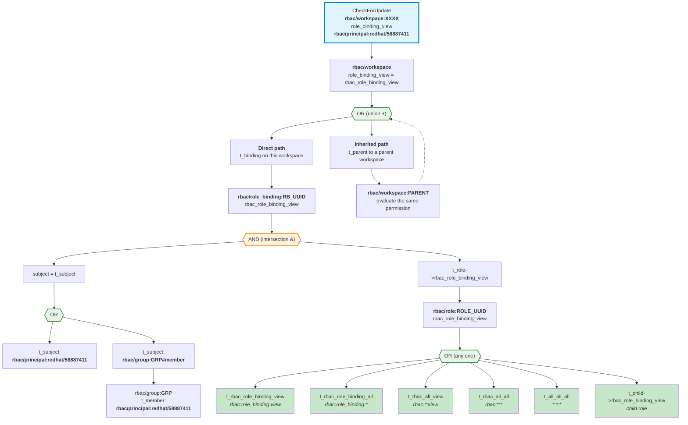
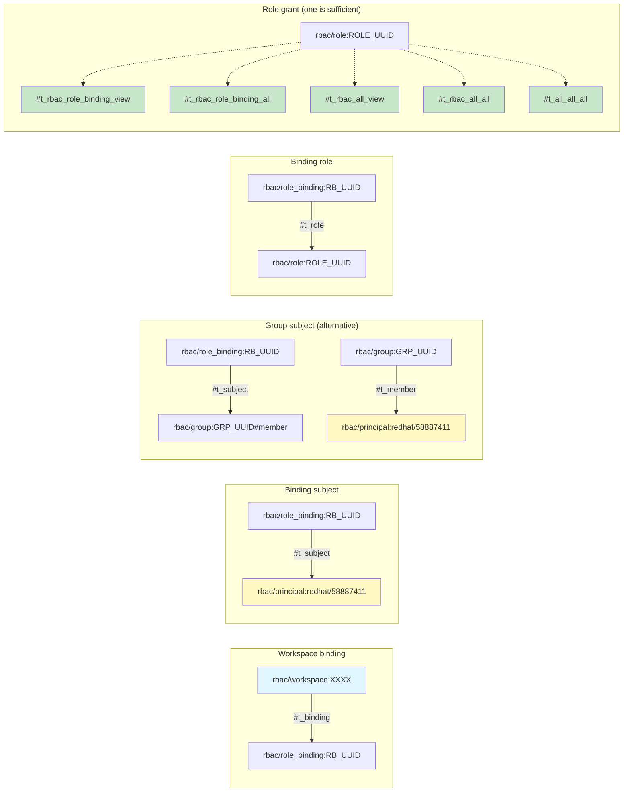
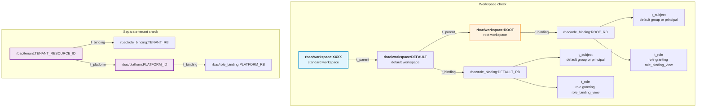
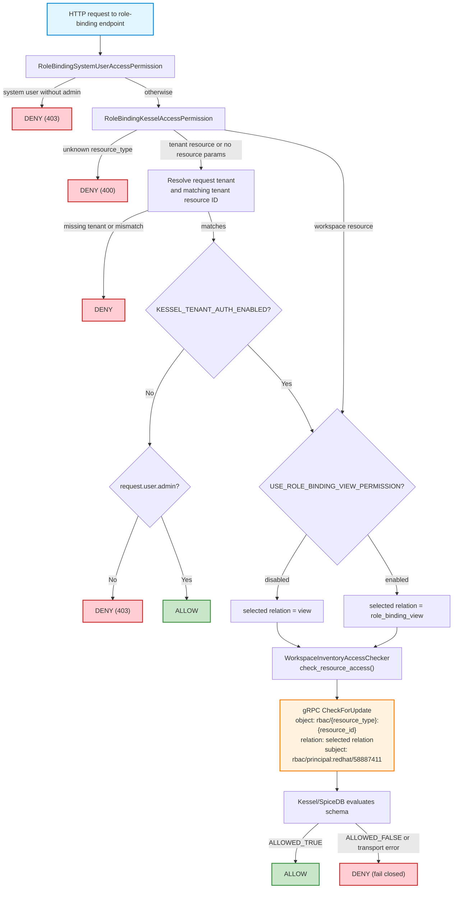
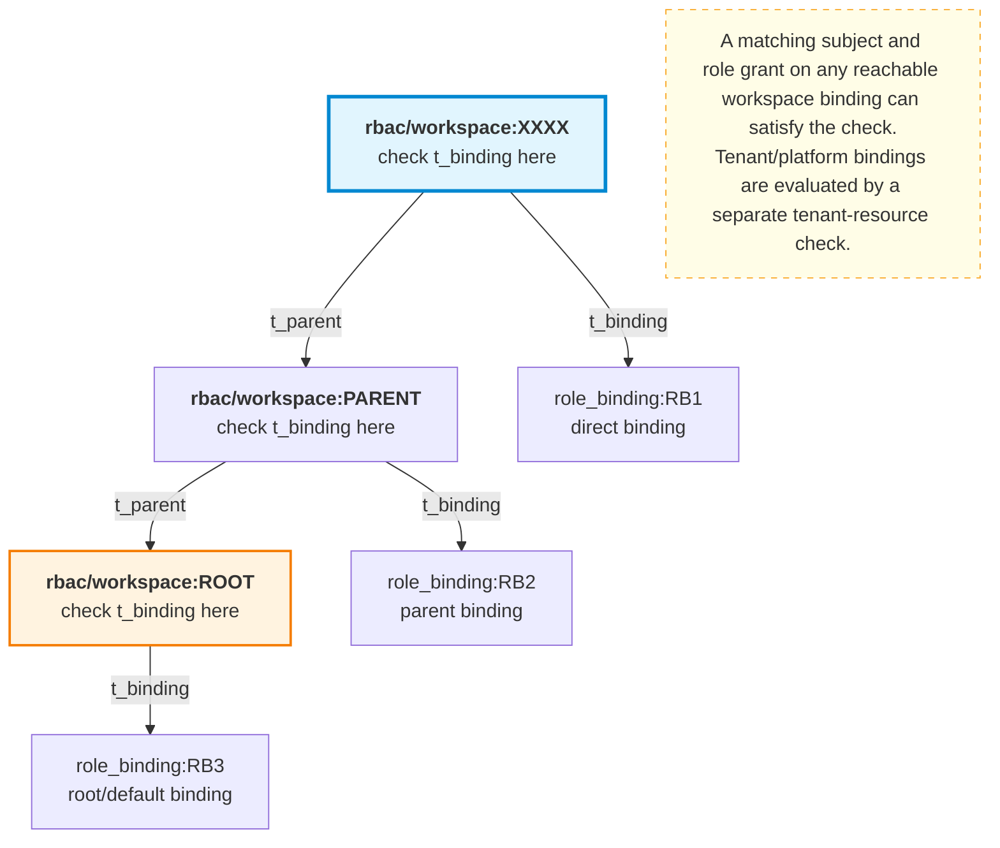
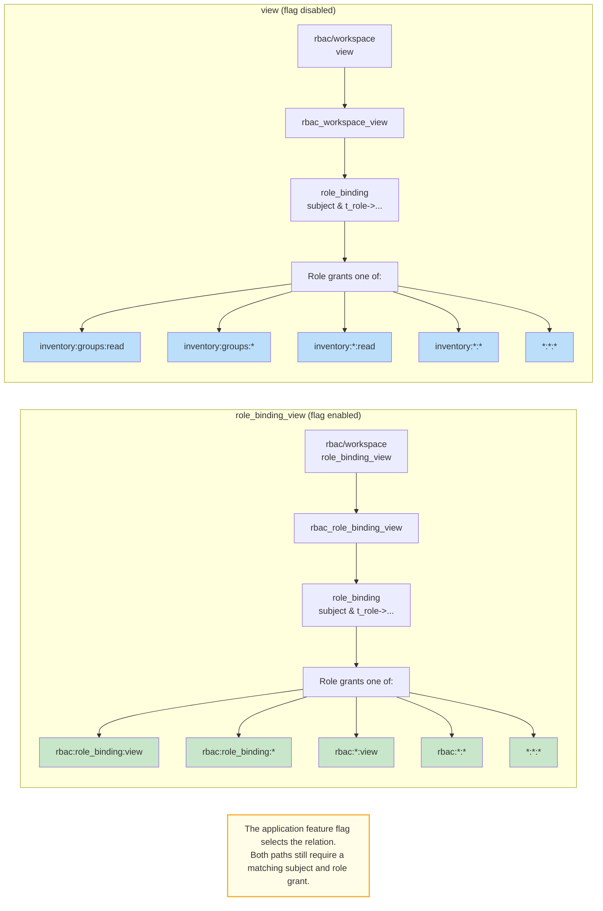
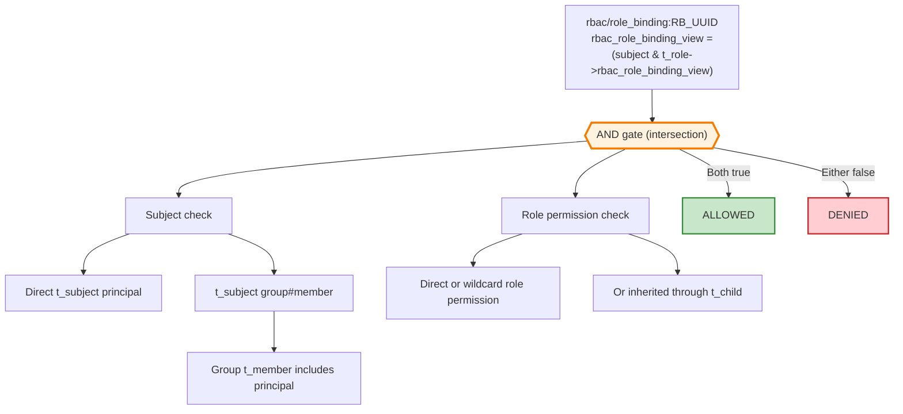

# Kessel Check: `role_binding_view` diagrams

The diagrams use relation names from the generated `schema.zed`.

## Diagram 1: Workspace evaluation tree

## Diagram 2: Required tuples for custom workspace access

## Diagram 3: Workspace default access

Bindings on a parent workspace are inherited by descendants. Tenant and platform bindings are shown separately because they belong to tenant-resource checks.

## Diagram 4: Application code flow

## Diagram 5: Workspace hierarchy traversal

## Diagram 6: `role_binding_view` versus `view`

## Diagram 7: Role-binding intersection

